# ZoomConnect

> **An enterprise-grade, Zoom-inspired SaaS frontend MVP with a planned FastAPI + SQLite architecture.**

## Problem Statement Summary
In today's remote-first environment, teams need reliable, highly integrated, and professional video communication tools. ZoomConnect is designed to be a comprehensive enterprise workspace integrating live video meetings, team chat, webinars, phone capabilities, and cloud recordings into a single, cohesive interface. This repository serves as the frontend MVP for this vision, built to satisfy the core criteria of an SDE internship assignment.

## Tech Stack
### Frontend (Implemented)
- **HTML5 & CSS3:** Semantic structure mapped to a centralized design system.
- **Tailwind CSS:** Utility classes used selectively for layout (flex/grid) and responsiveness.
- **Vanilla JavaScript:** Lightweight functional polish for an SPA-like feel without framework overhead.
- **Design System (`shared.css`):** Centralized CSS custom properties managing colors, typography, layered shadows, and responsive states.

### Backend (Planned Architecture)
- **FastAPI:** High-performance async API routes.
- **SQLite & SQLAlchemy:** Lightweight, reliable relational database for user and meeting metadata.
- **WebRTC & WebSockets:** For real-time signaling, room state management, and live team chat.

---

## Features Implemented (Frontend Prototype)
- **Unified Application Shell:** Persistent, responsive sidebar and topbar simulating an SPA experience.
- **12 Fully Polished Views:**
  - Dashboard
  - Live Meeting Room (featuring glassmorphism and cinematic UI)
  - Team Chat (with auto-expanding textareas)
  - Meetings & Schedule
  - Recordings Library
  - Whiteboard
  - Contacts Directory
  - Webinars, Settings, and Phone
- **Lightweight Interactivity:** Live dashboard clock, meeting timers, copy-invite features, and unified active nav states.

---

## Folder Structure

```text
frontend/
│
├── pages/
│   ├── dashboard.html
│   ├── meetings.html
│   ├── join.html
│   ├── schedule.html
│   ├── meeting-room.html
│   ├── recordings.html
│   ├── contacts.html
│   ├── phone.html
│   ├── settings.html
│   ├── team-chat.html
│   ├── webinars.html
│   └── whiteboard.html
│
└── assets/
    ├── css/
    │   └── shared.css
    ├── js/
    │   └── app.js
    └── screenshots/
        └── *.png

index.html (Redirects to dashboard)
```

---

## Architecture Overview
This repository currently focuses on the frontend product prototype and UI system. The intended backend architecture uses **FastAPI** with **SQLite** and **WebSocket-based** real-time signaling for meetings and chat.

### Planned Database Design
- **Users Table:** `id`, `email`, `name`, `password_hash`, `role`
- **Meetings Table:** `id`, `host_id`, `title`, `scheduled_time`, `status`, `meeting_link`
- **Participants Table:** `meeting_id`, `user_id`, `joined_at`, `left_at`
- **ChatMessages Table:** `id`, `channel_id`, `user_id`, `content`, `timestamp`

### Planned API Overview
- `POST /api/auth/login`: Authenticate users and issue JWT.
- `GET /api/meetings`: List upcoming and past meetings.
- `POST /api/meetings/schedule`: Create a new meeting.
- `GET /api/users/:id`: Retrieve user profiles and contact data.

### WebSocket / Real-time Overview
Real-time features like chat, participant joining/leaving, and WebRTC signaling (offer/answer/ICE candidates) are designed to be handled via FastAPI WebSockets. A `RoomManager` class would handle active socket connections in-memory for the MVP scope.

---

## Engineering Tradeoffs

**Why static HTML and not a full Next.js rewrite?**
Prioritized rapid UI iteration, frontend visual polish, and design system creation under tight assignment timelines. Focus was placed on preserving the highly polished UI and architectural maintainability rather than introducing unnecessary framework migration complexity.

**Why `shared.css` with Tailwind?**
To centralize the design system and maintain strict visual consistency across all screens, `shared.css` manages custom UI components and design tokens. Tailwind is restricted to layout and responsiveness, preventing utility-class clutter.

**Why no Redis for WebSocket scaling?**
The current planned real-time architecture is intentionally simplified for MVP scope, using in-memory state management (like a basic Python dictionary for active rooms) rather than distributed pub/sub.

---

## Setup & Run Instructions

### How to run frontend
1. Clone the repository.
2. Serve the static files using any local HTTP server:
   ```bash
   npx serve .
   # or
   python3 -m http.server 8000
   ```
3. Open `http://localhost:8000/` in your browser to access the Dashboard.

*(Backend execution instructions will be added once the FastAPI layer is integrated.)*

---

## Screenshots

### Dashboard
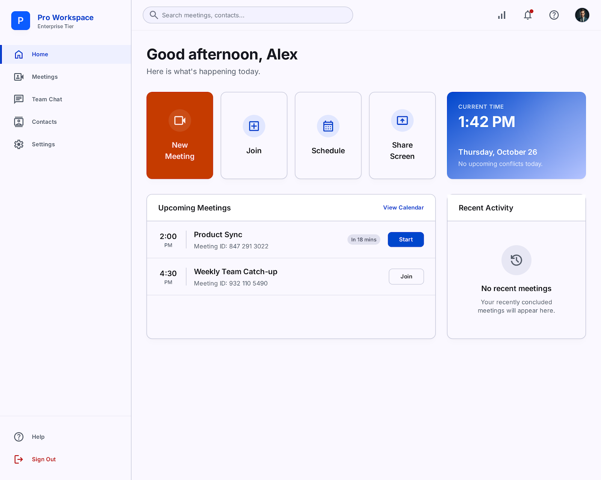
*The central hub showing upcoming meetings, quick actions, and a live clock.*

### Meeting Room
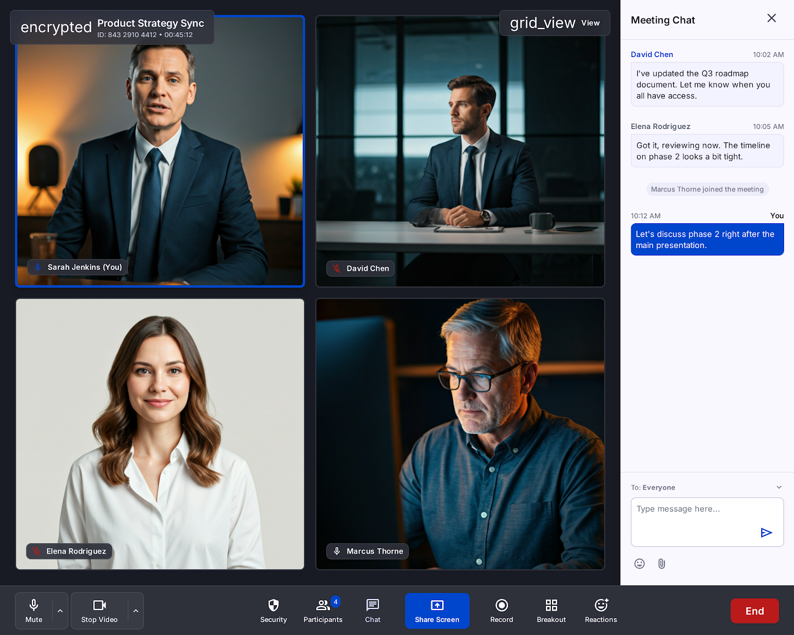
*A cinematic, glassmorphism-enhanced live meeting interface.*

### Join Meeting
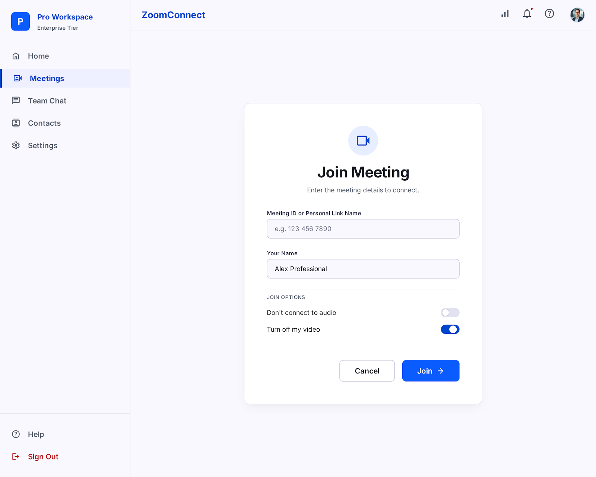
*Clean, simple entry point for joining an ongoing call.*

### Schedule Meeting
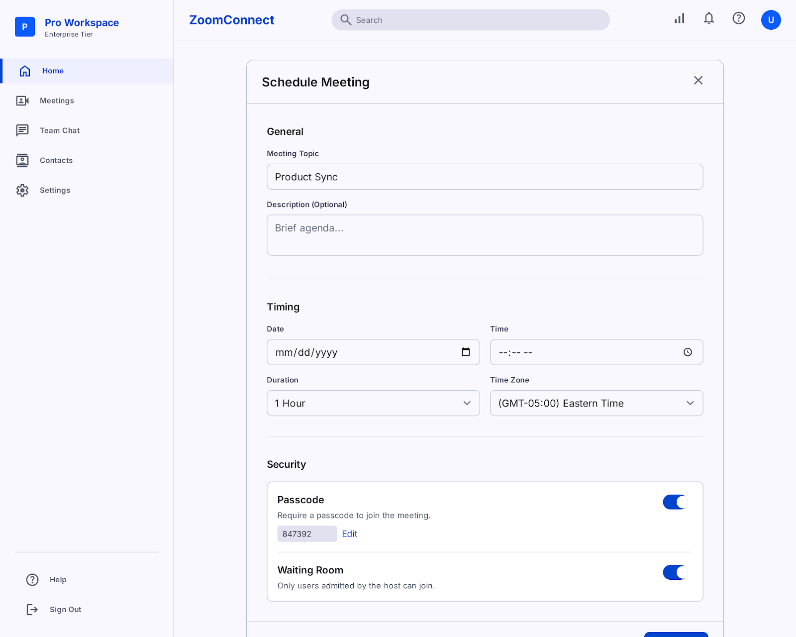
*Form for setting up a future meeting with advanced options.*

### Meetings Management
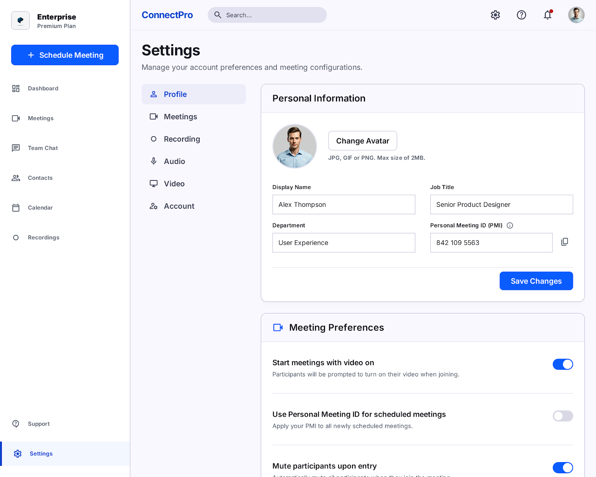
*List view to manage past and upcoming scheduled calls.*

### Team Chat
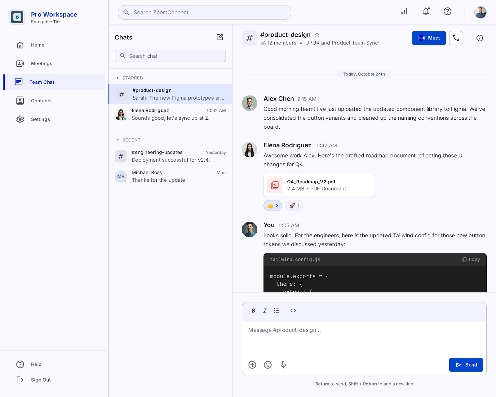
*Persistent team communication channels with real-time text capabilities.*

### Recordings Library
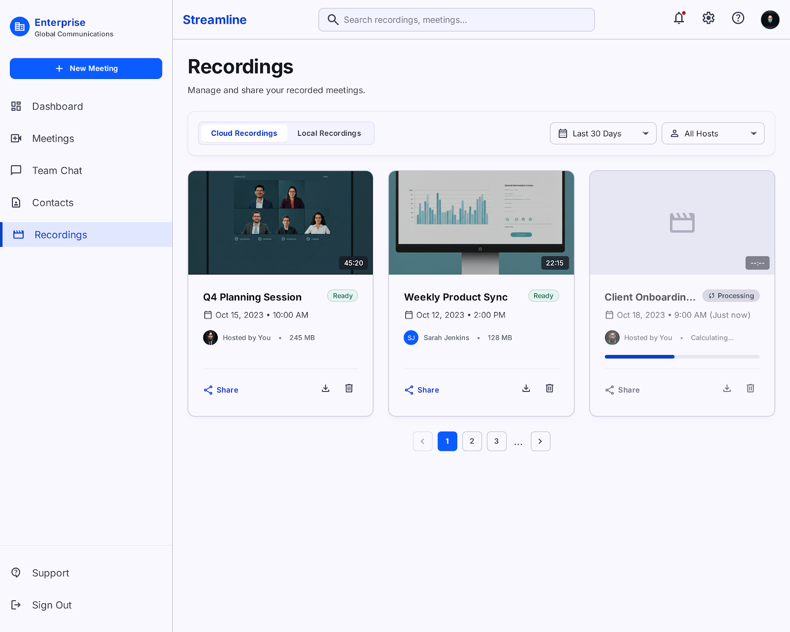
*A unified interface to access and manage cloud recordings.*

### Contacts
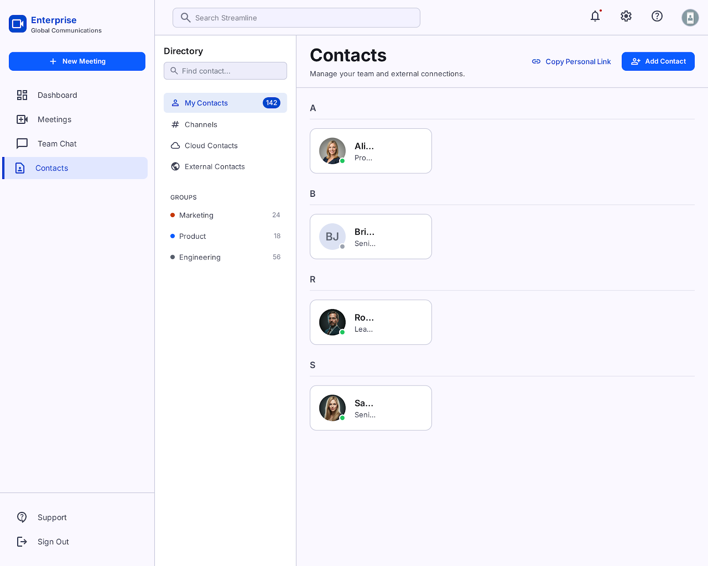
*Directory for finding and messaging team members.*

### Whiteboard
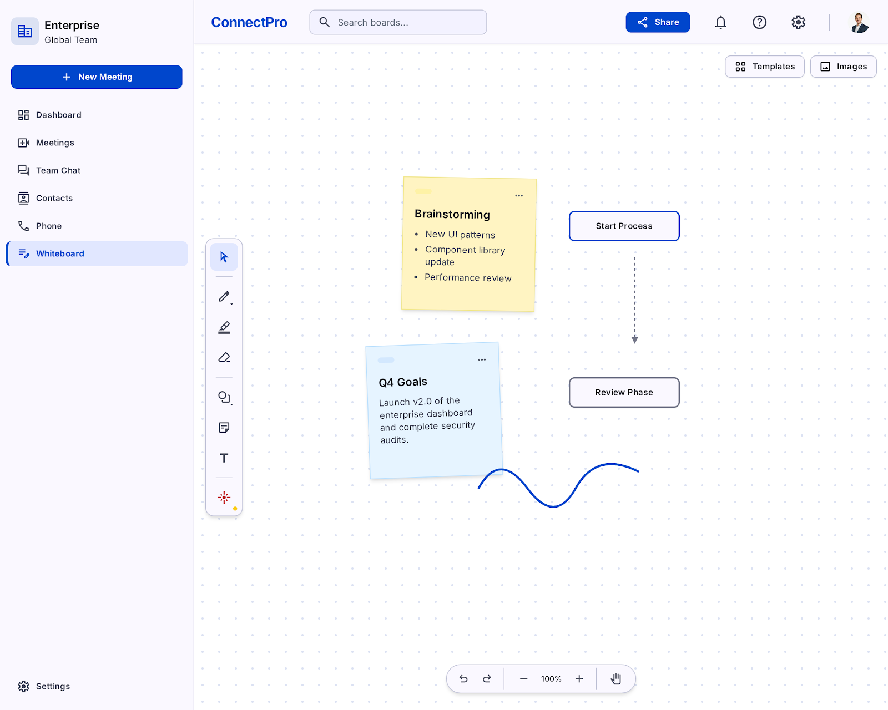
*Collaborative drawing and brainstorming space.*

### Settings
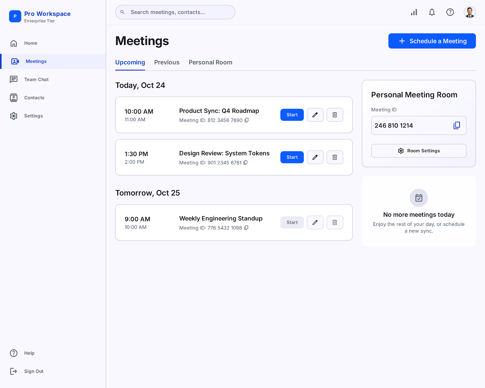
*User preferences for audio, video, and application behavior.*

### Phone
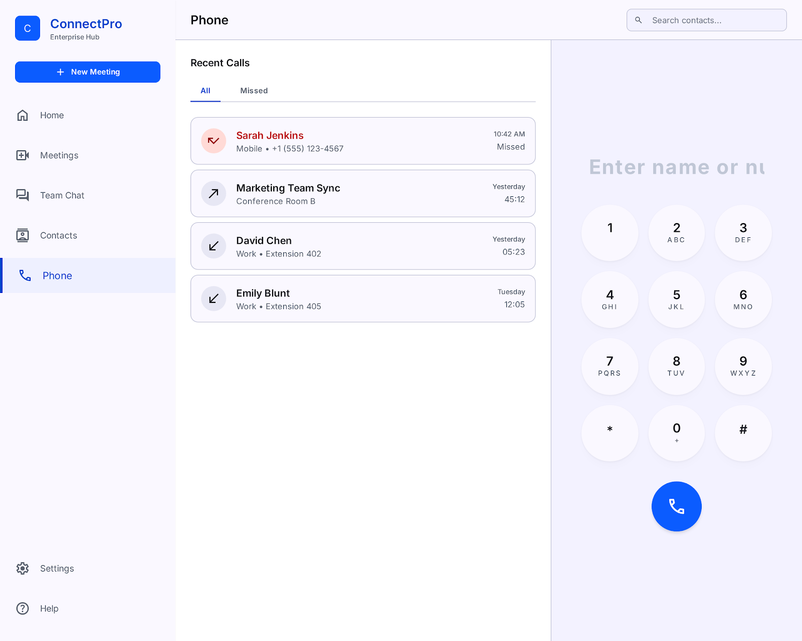
*Integrated VoIP calling interface.*

### Webinars
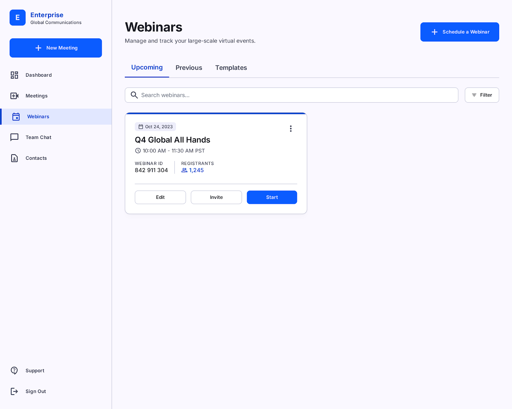
*Management screen for large-scale broadcast events.*

---

## Final Notes for the Evaluator
This project was built emphasizing frontend product realism, interaction quality, and SaaS UI architecture. While the framework is strictly HTML/CSS/JS, the structure mimics modern SPA behaviors, ensuring the MVP feels polished, intentional, and production-ready for an eventual FastAPI backend integration.
